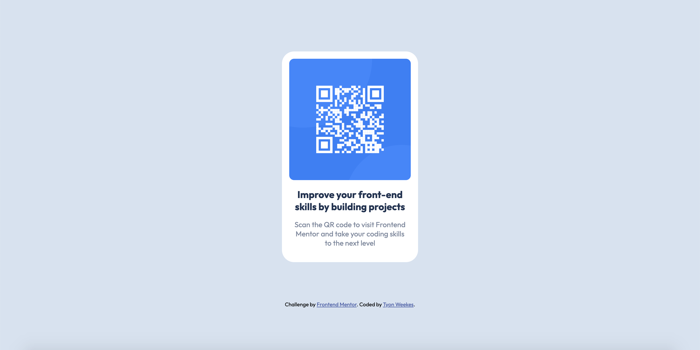

# Frontend Mentor - QR code component solution

This is a solution to the [QR code component challenge on Frontend Mentor](https://www.frontendmentor.io/challenges/qr-code-component-iux_sIO_H). Frontend Mentor challenges help you improve your coding skills by building realistic projects. 

## Table of contents

- [Overview](#overview)
  - [Screenshot](#screenshot)
  - [Links](#links)
- [My process](#my-process)
  - [Built with](#built-with)
  - [What I learned](#what-i-learned)
  - [Continued development](#continued-development)
- [Author](#author)

## Overview

### Screenshot

### Links

- Live Site URL: [Coming Soon](https://your-live-site-url.com)

### Built with

- CSS variables
- CSS Grid

### What I learned

- how to horizontally and vertically align content
- how to keep everything in one container

### Continued development

I would like to practice responsive design, Bootstrap, animations and some basic JavaScript.

## Author

- Website - [Tyon Weekes](https://www.tyonweekes.com)
